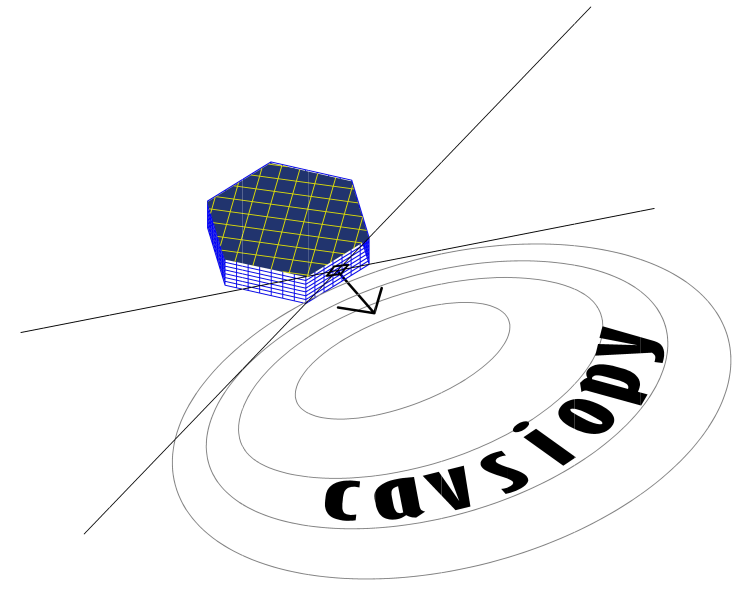

# cavsiopy: Calculation and Visualization of Spacecraft Instrument Orientation



Welcome to cavsiopy!
====================================
'cavsiopy' is an open source Python package, which was specifically developed to determine the look direction of the Radio Receiver Instrument (RRI) on the e-POP/ CASSIOPE/ Swarm-E for HF radio wave propagation studies, but can be applied to any satellite mission requiring accurate pointing information. Given the spacecraft position, the roll, yaw, and pitch angles, the body vector of the instrument, and a target location, the pointing direction and orientation of the instrument onboard the spacecraft with respect to the target can be determined in various reference frames. 'cavsiopy' supports the reference frames: Geocentric Equatorial Inertial J2000 (GEI J2K), Earth Centered Earth Fixed (ECEF), International Terrestrial Reference Frame (ITRF), geodetic North-East-Down, and geocentric North-East-Center. 

cavsiopy contains routines for 

1. Rotating the look direction of an instrument on-board the spacecraft in orbital frame 

2. Calculation of the look angles of the spacecraft (elevation and azimuth) 

3. Calculation of the look angles of the instrument (elevation and azimuth) 

4. Calculation of the distance between the spacecraft and a designated point on the ground 

5. Calculation of the line-of-sight direction vector from the target to the spacecraft location

6. Transformations between GEI J2K, ECEF, NED, NEC, ICRF, ITRF reference frames 

7. Visualization of spacecraft and instrument direction in 2D and 3D (simple or overlaid on geographical regions of the Earth below the satellite trajectory)

8. Rotation matrices for rotations by x, y, z axes

Instrument pointing direction vectors can be obtained in GEI J2K, ECEF, NED, NEC, ICRF, ITRF.

Dependencies
------------
numpy, matplotlib, astropy, cartopy, geopy, h5py, pysofa2

Installation
------------
Before installing cavsiopy some of the dependencies may need special installation instructions:

# cartopy

- If you are installing cartopy via pip (on Ubuntu/Debian) first libgeos-dev has to be on your system:

```
$ sudo apt -y install libgeos-dev
$ pip install -r requirements.txt
```

- Follow the installation guide for other systems: https://scitools.org.uk/cartopy/docs/latest/installing.html

- for installation of cartopy with conda:

```
$ conda install -c conda-forge cartopy
```

Other packages and requirements
-------------------------------
```
pip install --no-deps astropy

pip install geopy

pip install pysofa2

pip install -r requirements.txt
```
** Now, we are good to go! **

```
pip install cavsiopy
```

Version 1.1.0 Release Highlights: 'pysofa2' Integration and Updates
-------------------------------------------------------------------

In previous versions, cavsiopy used the 'pysofa' package developed by Frederic Grollier in 2010.

Starting from version 1.1.0, we have transitioned to using 'pysofa2.'

To address missing functions in 'pysofa2,' we introduced 'complement_missing_sofa.py,' which utilizes the SOFA C Library compiled by 'pysofa2.'

In addition, we made the following updates:

1. In the 'rri\_example,' the 'rotate\_rri' function, which rotated the instrument's body vector, has been replaced with 'rotate\_inst.'
2. 'attitude\_3d\_ground\_quiver' has been enhanced to display a line connecting the subsatellite point with the ground target on the ground map.
3. name changes for several functions in auxiliary\preliminary\_data\_analysis.py module : plot\_data\_validity, import\_quaternions.

Credits: E. Ceren K. Eyiguler, Warren Holley, Andrew D. Howarth, Donald W. Danskin, Kuldeep Pandey, Carley J. Martin

Contributing: Glenn C. Hussey, Robert Gillies, Andrew W. Yau

License: GNU LESSER GENERAL PUBLIC LICENSE Version 3, 29 June 2007
